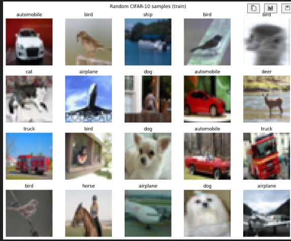
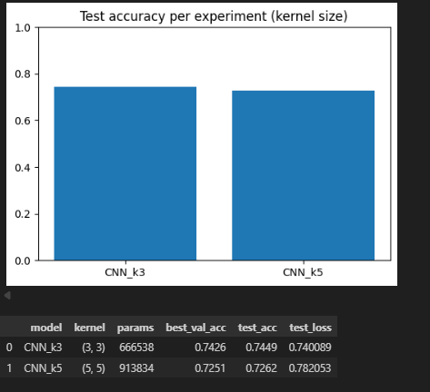

# Exploring Convolutional Layers Through Data and Experiments

This project studies **convolutional layers (CNNs)** as architectural building blocks (not black boxes) by running a small, intentional set of experiments on an image dataset. We first build a **non-convolutional baseline (MLP)**, then design a **simple CNN**, and finally run **one controlled experiment** on the convolutional layer (kernel size) to analyze trade-offs in performance vs. complexity and relate results to **inductive bias**.

---

## Getting Started

### Prerequisites

- **Python 3.9+** (recommended: 3.10 or 3.11)
- **pip** or **conda**
- (Optional) **GPU** with CUDA for faster training

Libraries used in the notebook:
- `tensorflow`
- `numpy`, `pandas`
- `matplotlib`
- `scikit-learn`
- (Optional) `kagglehub` (the notebook includes it, but CIFAR-10 can be loaded directly from Keras)

---

## Installing

### 1) Create and activate a virtual environment (recommended)

**Windows (PowerShell)**
```bash
python -m venv .venv
.venv\Scripts\activate
````

**macOS / Linux**

```bash
python -m venv .venv
source .venv/bin/activate
```

### 2) Install dependencies

```bash
pip install --upgrade pip
pip install numpy pandas matplotlib scikit-learn tensorflow kagglehub
```

> Note: `kagglehub` is optional if you only use `tensorflow.keras.datasets.cifar10`.

---

## Usage (Run the Notebook)

Open and run the notebook top-to-bottom:

```bash
jupyter notebook
```

Then open:

* `neural_network.ipynb`

**Demo output you should see**

* Dataset shapes (CIFAR-10):

  * Train: `(50000, 32, 32, 3)`
  * Test: `(10000, 32, 32, 3)`
* A class distribution table / plot
* Baseline and CNN training logs + final test metrics

---

## Project Structure

* `neural_network.ipynb` — main notebook (EDA, baseline, CNN design, controlled experiments, interpretation, deployment notes)
* `README.md` (this file)

---

## Dataset Description

**Dataset:** CIFAR-10 (loaded via `tensorflow.keras.datasets.cifar10`)

* **Type:** RGB images (2D tensors with channels)
* **Image shape:** `32 × 32 × 3`
* **Classes:** 10 (airplane, automobile, bird, cat, deer, dog, frog, horse, ship, truck)
* **Size:** 50,000 train + 10,000 test
* **Class distribution:** Balanced (5,000 train / 1,000 test per class)

### Minimal EDA (what we check)

* Split sizes and class distribution (counts per class)
* Image dimensions + channels
* Pixel value range (`0–255`) and normalization needs
* Sample visualizations (random grid of images)

### Preprocessing

* Normalize pixels to `[0,1]` using `x.astype(float32) / 255.0`
* Train/Validation split (80/20) using stratified sampling

---

## Baseline Model (Non-Convolutional)

To establish a reference point, we implement an **MLP without convolution**:

### Baseline Architecture (MLP)

```
Input (32×32×3)
 -> Flatten (3072)
 -> Dense(512, ReLU) -> Dropout(0.3)
 -> Dense(256, ReLU) -> Dropout(0.3)
 -> Dense(10, Softmax)
```

* **Parameters:** 1,707,274
* **Training setup:** Adam + sparse categorical crossentropy, batch=64, up to 7 epochs, EarlyStopping(patience=3)
* **Observed limitation:** Treats the image as a long vector and loses spatial structure (local patterns, edges, textures).

### Baseline Result 

* **Test accuracy:** aprox. 0.3918
* **Test loss:** aprox. 1.7150

---

## Convolutional Architecture Design 

We design a **simple but intentional CNN**, using:

* **padding="same"** to preserve spatial size early
* **stride=1** to avoid skipping details
* **MaxPooling(2×2)** for downsampling and local invariance
* **Dropout** to reduce overfitting

### CNN Architecture Diagram

```
Input (32×32×3)
 -> [Conv(32, k×k, same) -> Conv(32, k×k, same) -> MaxPool(2×2) -> Dropout(0.25)]
 -> [Conv(64, k×k, same) -> Conv(64, k×k, same) -> MaxPool(2×2) -> Dropout(0.25)]
 -> [Conv(128, k×k, same) -> MaxPool(2×2) -> Dropout(0.25)]
 -> Flatten
 -> Dense(256, ReLU) -> Dropout(0.4)
 -> Dense(10, Softmax)
```

* **Parameters (k=3×3):** 666,538
* **Training setup:** Adam + sparse categorical crossentropy, batch=64, up to 7 epochs, EarlyStopping(patience=4)

### CNN Main Result 

* **Test accuracy:** aprox. 0.7272
* **Test loss:** aprox. 0.7713

---

## Controlled Experiment

We systematically vary **one** convolution aspect while keeping everything else fixed:

### Experiment Choice: Kernel Size

* Compare **3×3 vs 5×5** kernels
* Same optimizer, epochs, batch size, architecture depth, pooling strategy, etc.

### Quantitative Results



### Observations & Trade-offs

* **3×3** performed better in this run and used **fewer parameters**.
* **5×5** increases receptive field per layer but also increases compute/params; performance did not improve here.
* Stacking multiple 3×3 layers can approximate a larger receptive field with fewer parameters (and more non-linearity).

---

## Interpretation and Architectural Reasoning (Graded Heavily)

### Why did convolution outperform the baseline?

The CNN preserves and exploits **spatial structure** in images using **local connectivity** (small receptive fields) and **weight sharing** (same filter applied across positions). This helps it learn edges/textures/shapes that generalize across the image, while the MLP baseline must relearn similar patterns independently for many pixel positions.

### What inductive bias does convolution introduce?

Convolution encodes the assumption that:

* **Local patterns matter** (nearby pixels correlate),
* **Features repeat across positions** (translation-related structure),
* and thus learned filters should be **reusable** over the grid.

### When would convolution NOT be appropriate?

Convolution is less suitable when your data does **not** have a meaningful grid/spatial structure (or when locality/translation assumptions are wrong), e.g.:

* tabular data without spatial neighborhoods,
* some graph data (unless using graph convolutions),
* problems where global relationships dominate and locality is not helpful.

---

## Running the Tests

There are no separate automated unit tests in this repository. The “test” workflow is:

1. Open `neural_network.ipynb`
2. Run **all cells** top-to-bottom
3. Confirm:

   * dataset loads correctly
   * training completes
   * final metrics + plots appear as expected

### End-to-end checks

* Dataset shapes and class distribution match CIFAR-10 specs
* Baseline trains and produces aprox. 0.39 test accuracy (may vary slightly)
* CNN trains and significantly outperforms baseline ( aprox. 0.72+ test accuracy)
* Kernel experiment table prints with both runs

---

## Deployment 

It cannot be deployed because, as it is a student profile, it does not allow us to create endpoints.
We will see more details of the deployment in the booklet.

---

## Built With

* **Python**
* **TensorFlow / Keras**
* **NumPy**, **Pandas**
* **Matplotlib**
* **Scikit-learn**
* **Jupyter Notebook**
* (Deployment target) **AWS SageMaker**

---

## Contributing

This is a course assignment repository. If collaboration is allowed, use small, clear pull requests and document architectural changes (especially anything affecting kernel/stride/padding/pooling).

---

## Authors

* **David Santiago Castro** — initial work and experiments

---


---

## Acknowledgments

* CIFAR-10 dataset creators and maintainers
* TensorFlow/Keras documentation and examples (used for API reference, not for copy-paste architectures)
* Course materials on architectural reasoning and inductive bias

